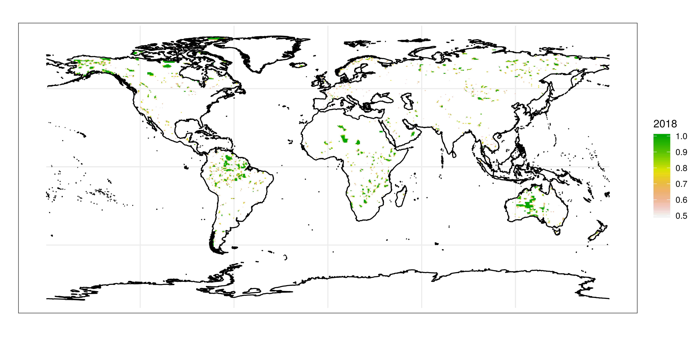

futurePA - Future vertebrate richness changes in protected areas under
climate change
================

<!--
## MATERIAL AND METHODS

Global protected area data was downloaded from protectedplanet.net in Feburary 2018.  

We consider temperature, precipitation, seasonality in temperature and precipitation, elevation, isolation, and connectivity. Using bioclimatic data for current and future conditions and IUCN range maps, we model current and future global vertebrate richness (amphibians, mammals and birds) of current protected areas to assess its coverage with regard to global biodiversity.

Species-specific IUCN range maps were used as response variable of the SDMs and to create current species richness maps for each of the three taxonomic groups. Bioclimatic variables derived from the meteorological forcing dataset EartH2Observe, WFDEI and ERA-Interim data Merged and Bias-corrected for ISIMIP (EWEMBI) were used as explanatory variables for the SDMs. We compare species richness of protected areas with specis richness of non-protected areas. We then create future predictions using future bioclimatic variables of 4 global climate models (GFDL-ESM2M, MIROC5, HadGEM2-ES, IPSL-CM5A-LR) and two representative concentration pathways (RCP2.6 and RCP6.0) and compare the future predictions of species richness among the protected and non-protected areas.

## RESULTS

As of August 2014, there are currently 209,429 designated protected areas worldwide, covering an area of 32,868,673 km2 (Deguignet et al. 2014).

We obtained polygon data for 217825 (203167 terrestrial and 14658 coastal & marine) protected areas and point data for 18406 (17460 terrestrial and 946 coastal & marine) protected areas.
-->

## Maps of PAs

<!-- -->

**Fig. 1.** Protected areas and their percentage coverage in 1995.

<!-- --> **Fig. 2.** Protected areas and
their percentage coverage in 2018.

<!-- -->

**Fig. 3.** Current and future conditions of bio1 within protected
areas.

<!-- -->

**Fig. 4.** Current and future conditions of bio4, bio5, bio12, bio15,
bio18 and bio19 within protected areas.

<!-- -->

**Fig. 5.** Current (1995) and future (2080) species richness of
amphibians, birds and mammals within protected areas.

<!-- -->

**Fig. 6.** Change in total species richness (2080-1995) within
protected areas for each country.

<!-- -->

**Fig. 7.** Change in total species richness (2080-1995) within
protected areas of each continent.

<!-- -->

**Fig. 8.** Change in total species richness (2080-1995) within
protected areas of each realm.

<!-- -->

**Fig. 9.** Change in total species richness (2080-1995) within
protected areas of each biome.
